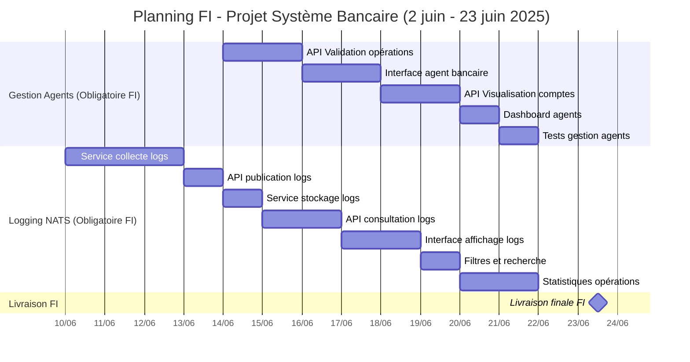

```mermaid
gantt
    title Planning FI - Projet Système Bancaire (2 juin - 23 juin 2025)
    dateFormat  YYYY-MM-DD
    axisFormat  %d/%m

    section Gestion Agents (Obligatoire FI)
    API Validation opérations     :agent-api, 2025-06-14, 2d
    Interface agent bancaire      :agent-ui, after agent-api, 2d
    API Visualisation comptes     :view-api, after agent-ui, 2d
    Dashboard agents              :dashboard, after view-api, 1d
    Tests gestion agents          :agent-test, after dashboard, 1d

    section Logging NATS (Obligatoire FI)
    Service collecte logs         :log-collect, 2025-06-10, 3d
    API publication logs          :log-publish, after log-collect, 1d
    Service stockage logs         :log-storage, after log-publish, 1d
    API consultation logs         :log-api, after log-storage, 2d
    Interface affichage logs      :log-ui, after log-api, 2d
    Filtres et recherche          :log-filters, after log-ui, 1d
    Statistiques opérations       :log-stats, after log-filters, 2d

    section Livraison FI
    Livraison finale FI           :milestone, delivery-fi, 2025-06-23, 1d
```
