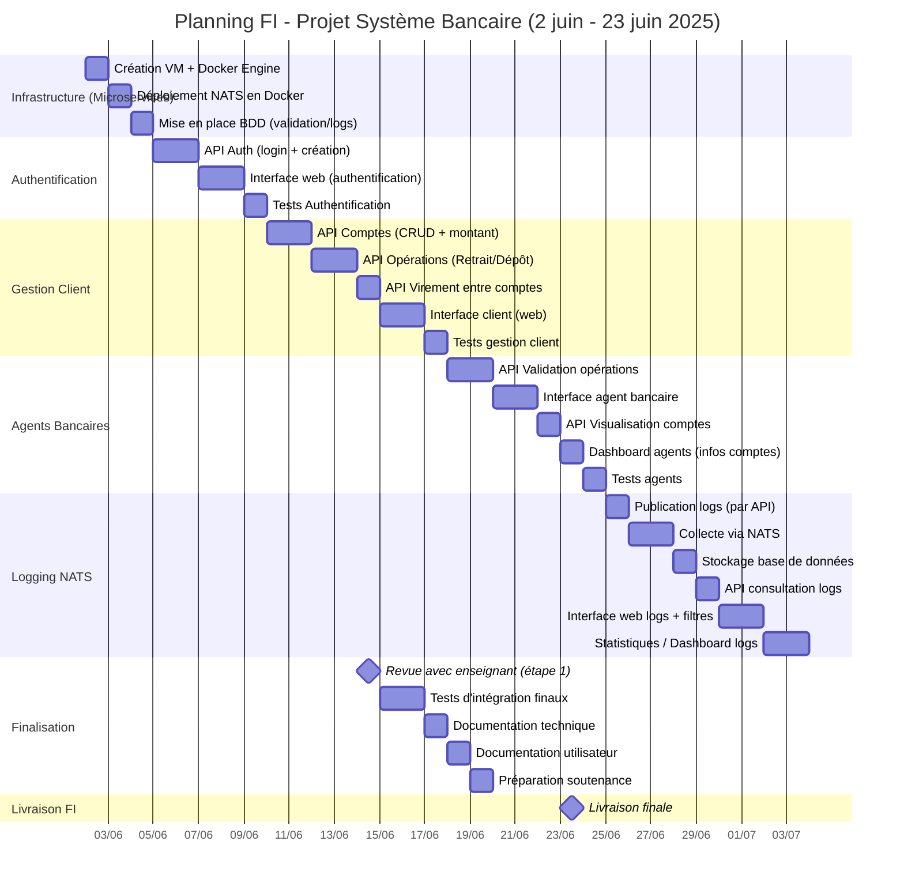

```mermaid
gantt
    title Planning FI - Projet Système Bancaire (2 juin - 23 juin 2025)
    dateFormat  YYYY-MM-DD
    axisFormat  %d/%m

    section Infrastructure (Microservices)
    Création VM + Docker Engine     :vm-setup, 2025-06-02, 1d
    Déploiement NATS en Docker      :nats-docker, after vm-setup, 1d
    Mise en place BDD (validation/logs) :db-setup, after nats-docker, 1d

    section Authentification
    API Auth (login + création)     :auth-api, after db-setup, 2d
    Interface web (authentification):auth-ui, after auth-api, 2d
    Tests Authentification          :auth-test, after auth-ui, 1d

    section Gestion Client
    API Comptes (CRUD + montant)    :client-api, after auth-test, 2d
    API Opérations (Retrait/Dépôt)  :ops-api, after client-api, 2d
    API Virement entre comptes      :virement-api, after ops-api, 1d
    Interface client (web)          :client-ui, after virement-api, 2d
    Tests gestion client            :client-test, after client-ui, 1d

    section Agents Bancaires
    API Validation opérations       :agent-api, after client-test, 2d
    Interface agent bancaire        :agent-ui, after agent-api, 2d
    API Visualisation comptes       :view-api, after agent-ui, 1d
    Dashboard agents (infos comptes):dashboard-agent, after view-api, 1d
    Tests agents                    :agent-test, after dashboard-agent, 1d

    section Logging NATS
    Publication logs (par API)      :log-publish, after agent-test, 1d
    Collecte via NATS               :log-collect, after log-publish, 2d
    Stockage base de données        :log-db, after log-collect, 1d
    API consultation logs           :log-api, after log-db, 1d
    Interface web logs + filtres    :log-ui, after log-api, 2d
    Statistiques / Dashboard logs   :log-stats, after log-ui, 2d

    section Finalisation
    Revue avec enseignant (étape 1) :milestone, checkpoint1, 2025-06-14, 1d
    Tests d'intégration finaux      :integration, after checkpoint1, 2d
    Documentation technique         :doc-tech, after integration, 1d
    Documentation utilisateur       :doc-user, after doc-tech, 1d
    Préparation soutenance          :prep, after doc-user, 1d

    section Livraison FI
    Livraison finale                :milestone, delivery-fi, 2025-06-23, 1d
```
