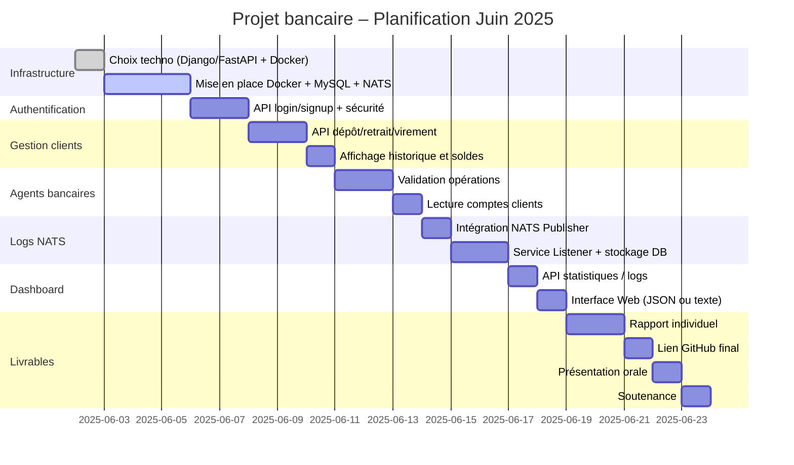

```mermaid


gantt
    title Projet bancaire – Planification Juin 2025
    dateFormat  YYYY-MM-DD

    section Infrastructure
    Choix techno (Django/FastAPI + Docker)       :done, 2025-06-02, 1d
    Mise en place Docker + MySQL + NATS          :active, 2025-06-03, 3d

    section Authentification
    API login/signup + sécurité                  :2025-06-06, 2d

    section Gestion clients
    API dépôt/retrait/virement                   :2025-06-08, 2d
    Affichage historique et soldes               :2025-06-10, 1d

    section Agents bancaires
    Validation opérations                        :2025-06-11, 2d
    Lecture comptes clients                      :2025-06-13, 1d

    section Logs NATS
    Intégration NATS Publisher                   :2025-06-14, 1d
    Service Listener + stockage DB               :2025-06-15, 2d

    section Dashboard
    API statistiques / logs                      :2025-06-17, 1d
    Interface Web (JSON ou texte)                :2025-06-18, 1d

    section Livrables
    Rapport individuel                           :2025-06-19, 2d
    Lien GitHub final                            :2025-06-21, 1d
    Présentation orale                           :2025-06-22, 1d
    Soutenance                                   :2025-06-23, 1d
```
