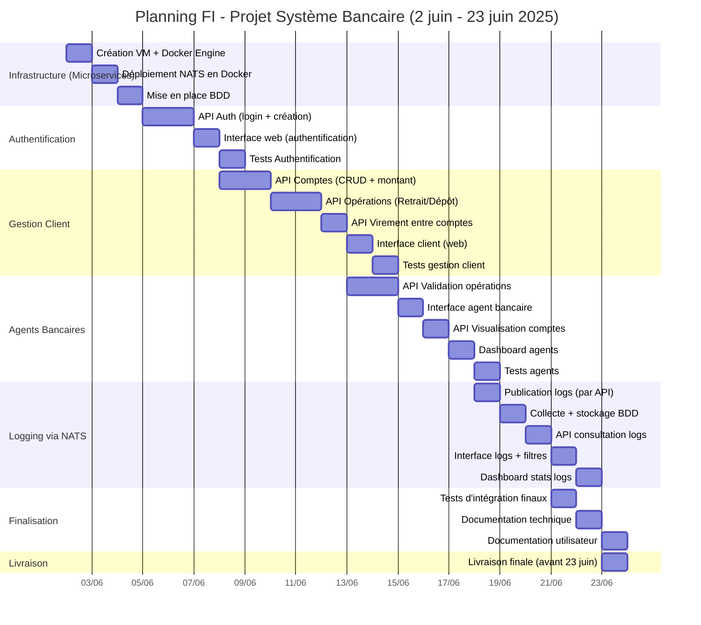

```mermaid
gantt
    title Planning FI - Projet Système Bancaire (2 juin - 23 juin 2025)
    dateFormat  YYYY-MM-DD
    axisFormat  %d/%m

    section Infrastructure (Microservices)
    Création VM + Docker Engine     :vm-setup, 2025-06-02, 1d
    Déploiement NATS en Docker      :nats-docker, after vm-setup, 1d
    Mise en place BDD               :db-setup, after nats-docker, 1d

    section Authentification
    API Auth (login + création)     :auth-api, 2025-06-05, 2d
    Interface web (authentification):auth-ui, after auth-api, 1d
    Tests Authentification          :auth-test, after auth-ui, 1d

    section Gestion Client
    API Comptes (CRUD + montant)    :client-api, 2025-06-08, 2d
    API Opérations (Retrait/Dépôt)  :ops-api, after client-api, 2d
    API Virement entre comptes      :virement-api, after ops-api, 1d
    Interface client (web)          :client-ui, after virement-api, 1d
    Tests gestion client            :client-test, after client-ui, 1d

    section Agents Bancaires
    API Validation opérations       :agent-api, 2025-06-13, 2d
    Interface agent bancaire        :agent-ui, after agent-api, 1d
    API Visualisation comptes       :view-api, after agent-ui, 1d
    Dashboard agents                :dashboard-agent, after view-api, 1d
    Tests agents                    :agent-test, after dashboard-agent, 1d

    section Logging via NATS
    Publication logs (par API)      :log-publish, 2025-06-18, 1d
    Collecte + stockage BDD         :log-collect, after log-publish, 1d
    API consultation logs           :log-api, after log-collect, 1d
    Interface logs + filtres        :log-ui, after log-api, 1d
    Dashboard stats logs            :log-stats, after log-ui, 1d

    section Finalisation
    Tests d'intégration finaux      :integration, 2025-06-21, 1d
    Documentation technique         :doc-tech, after integration, 1d
    Documentation utilisateur       :doc-user, after doc-tech, 0.5d

    section Livraison
    Livraison finale (avant 23 juin):delivery, 2025-06-23, 1d
```
