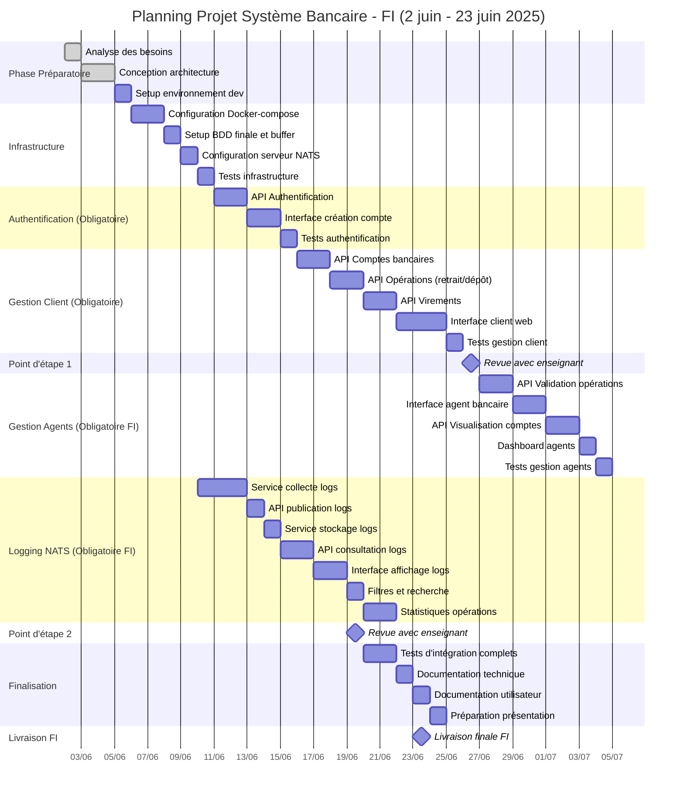

```mermaid
gantt
    title Planning Projet Système Bancaire - FI (2 juin - 23 juin 2025)
    dateFormat  YYYY-MM-DD
    axisFormat  %d/%m
    
    section Phase Préparatoire
    Analyse des besoins           :done, analysis, 2025-06-02, 1d
    Conception architecture       :done, arch, after analysis, 2d
    Setup environnement dev       :setup, after arch, 1d
    
    section Infrastructure
    Configuration Docker-compose  :docker, after setup, 2d
    Setup BDD finale et buffer    :db, after docker, 1d
    Configuration serveur NATS    :nats, after db, 1d
    Tests infrastructure          :infra-test, after nats, 1d
    
    section Authentification (Obligatoire)
    API Authentification          :auth-api, after infra-test, 2d
    Interface création compte     :auth-ui, after auth-api, 2d
    Tests authentification        :auth-test, after auth-ui, 1d
    
    section Gestion Client (Obligatoire)
    API Comptes bancaires         :accounts-api, after auth-test, 2d
    API Opérations (retrait/dépôt):ops-api, after accounts-api, 2d
    API Virements                 :transfer-api, after ops-api, 2d
    Interface client web          :client-ui, after transfer-api, 3d
    Tests gestion client          :client-test, after client-ui, 1d
    
    section Point d'étape 1
    Revue avec enseignant         :milestone, checkpoint1, after client-test, 1d
    
    section Gestion Agents (Obligatoire FI)
    API Validation opérations     :agent-api, after checkpoint1, 2d
    Interface agent bancaire      :agent-ui, after agent-api, 2d
    API Visualisation comptes     :view-api, after agent-ui, 2d
    Dashboard agents              :dashboard, after view-api, 1d
    Tests gestion agents          :agent-test, after dashboard, 1d
    
    section Logging NATS (Obligatoire FI)
    Service collecte logs         :log-collect, after nats, 3d
    API publication logs          :log-publish, after log-collect, 1d
    Service stockage logs         :log-storage, after log-publish, 1d
    API consultation logs         :log-api, after log-storage, 2d
    Interface affichage logs      :log-ui, after log-api, 2d
    Filtres et recherche          :log-filters, after log-ui, 1d
    Statistiques opérations       :log-stats, after log-filters, 2d
    
    section Point d'étape 2
    Revue avec enseignant         :milestone, checkpoint2, 2025-06-19, 1d
    
    section Finalisation
    Tests d'intégration complets  :integration, after checkpoint2, 2d
    Documentation technique       :doc-tech, after integration, 1d
    Documentation utilisateur     :doc-user, after doc-tech, 1d
    Préparation présentation      :prep, after doc-user, 1d
    
    section Livraison FI
    Livraison finale FI           :milestone, delivery-fi, 2025-06-23, 1d
```
